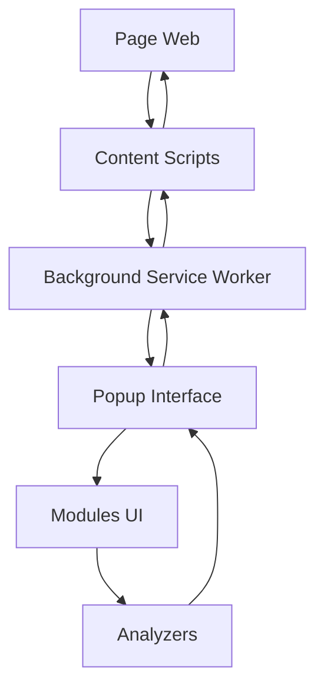

# 🔗 OptiRank - Extension Chrome d'Analyse de Liens et de Titres

## 📖 Table des Matières

1. [Vue d'ensemble](#vue-densemble)
2. [Installation](#installation)
3. [Utilisation](#utilisation)
4. [Architecture du Projet](#architecture-du-projet)
5. [Documentation Technique](#documentation-technique)
6. [Fonctionnalités Principales](#fonctionnalités-principales)
7. [Structure des Fichiers](#structure-des-fichiers)
8. [Modules Détaillés](#modules-détaillés)
9. [API et Fonctions](#api-et-fonctions)
10. [Développement](#développement)
11. [Troubleshooting](#troubleshooting)

---

## 🎯 Vue d'ensemble

**OptiRank** est une extension Chrome professionnelle qui analyse et valide automatiquement :
- ✅ **Liens** : Détection des liens cassés, redirections, temps de réponse
- ✅ **Titres (H1-H6)** : Analyse SEO de la hiérarchie des titres
- ✅ **Rapports détaillés** : Export des résultats au format CSV/JSON
- ✅ **Interface moderne** : Design élégant avec animations et visualisations

### Cas d'usage principaux
- **Développeurs web** : Validation qualité avant mise en production
- **SEO Specialists** : Audit de la structure des titres pour le référencement
- **Content Managers** : Vérification de l'intégrité des liens dans le contenu
- **QA Testers** : Tests automatisés de la qualité des pages web

---

## 🚀 Installation

### Méthode 1 : Installation en développement
```bash
# Cloner le repository
git clone https://github.com/votre-username/optirank.git
cd optirank

# Installer les dépendances
npm install

# Build du projet
npm run build
```

### Méthode 2 : Chargement dans Chrome
1. Ouvrir Chrome → `chrome://extensions/`
2. Activer le "Mode développeur"
3. Cliquer "Charger l'extension non empaquetée"
4. Sélectionner le dossier `optirank/`

### Méthode 3 : Installation depuis le Chrome Web Store
*(Bientôt disponible)*

---

## 🎮 Utilisation

### Lancement rapide
1. **Navigation** : Aller sur n'importe quelle page web
2. **Activation** : Cliquer sur l'icône OptiRank ou `Ctrl+Shift+L` (Mac: `Cmd+Shift+L`)
3. **Analyse** : L'extension lance automatiquement l'analyse
4. **Résultats** : Consulter les résultats dans le popup

### Interface utilisateur

#### 🔗 Onglet "Liens"
- **Vue d'ensemble** : Nombre de liens trouvés, statuts, temps de réponse
- **Filtrage avancé** : Par statut (✅ Valides, ❌ Cassés, ⚠️ Redirections)
- **Détails** : URL, code de réponse, temps de chargement, type de lien
- **Export** : Boutons de copie et export CSV/JSON

#### 📝 Onglet "Titres"
- **Compteurs visuels** : Nombre de H1, H2, H3, H4, H5, H6
- **Structure hiérarchique** : Visualisation de l'arborescence des titres
- **Analyse intelligente** : Détection automatique des problèmes SEO
- **Insights** : Recommandations pour améliorer la hiérarchie

---

## 🏗️ Architecture du Projet

### Pattern Architectural : **Modular MVC**

```
OptiRank/
├── 📁 popup/              # Interface utilisateur (Vue + Contrôleur)
├── 📁 content/            # Scripts d'injection (Modèle)
├── 📁 background/         # Service Worker (Communication)
├── 📁 assets/             # Ressources statiques
└── 📄 manifest.json       # Configuration Chrome Extension
```

### Flow de données

```
Page Web → Content Scripts → Background → Popup → Interface Utilisateur
    ↑                                               ↓
    └─────────── Modifications DOM ←──────────────┘
```

---

## 🔧 Documentation Technique

### Technologies utilisées
- **JavaScript ES6+** : Language principal
- **Chrome Extension Manifest V3** : API moderne
- **CSS3** : Interface responsive avec animations
- **Webpack** : Bundling et optimisation
- **Babel** : Transpilation pour compatibilité

### Permissions requises
```json
{
  "permissions": [
    "activeTab",      // Accès à l'onglet actif
    "tabs",           // Gestion des onglets
    "scripting",      // Injection de scripts
    "clipboardWrite", // Copie vers le presse-papier
    "storage",        // Stockage local des paramètres
    "webRequest"      // Interception des requêtes HTTP
  ],
  "host_permissions": ["<all_urls>"] // Accès à tous les sites
}
```

---

## ⭐ Fonctionnalités Principales

### 🔗 Module de Validation de Liens

#### **Détection intelligente**
- **Liens internes** : `<a href="/page">`, `<a href="#section">`
- **Liens externes** : `<a href="https://external.com">`
- **Liens email** : `<a href="mailto:test@example.com">`
- **Liens téléphone** : `<a href="tel:+33123456789">`
- **Images** : ``
- **Scripts et CSS** : `<script src="">`, `<link href="">`

#### **Validation avancée**
- **Codes de statut HTTP** : 200 (✅), 404 (❌), 301/302 (⚠️)
- **Détection de redirections** : Chaînes de redirections multiples
- **Mesure de performance** : Temps de réponse en millisecondes
- **Gestion des timeouts** : Éviter les blocages sur les liens lents

### 📝 Module d'Analyse des Titres

#### **Comptage intelligent**
- **Détection automatique** : Scan de tous les `<h1>` à `<h6>`
- **Compteurs visuels** : Affichage en temps réel des quantités
- **Synchronisation** : Mise à jour automatique lors des changements

#### **Analyse SEO avancée**
- **Hiérarchie** : Vérification de la structure logique H1→H2→H3
- **Titres orphelins** : H3 sans H2 parent, H4 sans H3 parent
- **Ratios déséquilibrés** : Trop de sous-titres par rapport aux parents
- **Titres vides** : Détection des balises H sans contenu
- **Recommandations** : Conseils automatiques pour l'optimisation

---

## 📁 Structure des Fichiers

### 📂 Dossier `/popup/` - Interface Utilisateur

```
popup/
├── popup.html              # Template principal de l'interface
├── popup.css               # Styles de l'interface principale  
├── popup.js                # Contrôleur principal et logique UI
├── improved-filters.js     # Système de filtrage avancé des résultats
├── headings.css            # Styles spécifiques au module titres
├── headings.html           # Template du module titres
└── headings/               # Module d'analyse des titres
    ├── core/
    │   └── init.js         # Initialisation et coordination du module
    ├── ui/
    │   ├── display.js      # Affichage et rendu des résultats
    │   └── copy.js         # Fonctionnalités de copie et export
    ├── utils/
    │   └── utils.js        # Utilitaires et fonctions helper
    └── analyzers/
        └── issues-detector.js # Détection intelligente des problèmes SEO
```

### 📂 Dossier `/content/` - Scripts d'Injection

```
content/
├── optiRankMain.js        # Script principal d'injection
├── loader-modular.js      # Chargeur modulaire dynamique
├── common/
│   ├── utils.js           # Utilitaires communs
│   └── data.js            # Gestion des données et cache
├── links/
│   ├── detection/
│   │   └── detector.js    # Détection des liens dans le DOM
│   ├── validation/
│   │   ├── validator.js   # Validation HTTP des liens
│   │   └── redirectDetector.js # Détection des redirections
│   └── processing/
│       ├── processor.js   # Traitement des résultats
│       └── scanner.js     # Orchestration du scan
├── headings/
│   └── detector.js        # Détection des titres H1-H6
├── ui/
│   └── styles.js          # Injection des styles pour la visualisation
└── reports/
    └── reporter.js        # Génération des rapports
```

### 📂 Dossier `/background/` - Service Worker

```
background/
└── background.js          # Communication entre content scripts et popup
```

---

## 🧩 Modules Détaillés

### 🎯 Module Core (`popup/headings/core/`)

#### **`init.js` - Coordinateur Principal**

**Rôle** : Orchestration générale du module d'analyse des titres

**Fonctions principales** :

##### `initHeadingsModule()`
- **But** : Initialisation complète du module titres
- **Process** :
  1. Reset des compteurs à zéro
  2. Vérification de la disponibilité des sous-modules
  3. Lancement de l'analyse automatique si possible
- **Intérêt** : Point d'entrée unique pour activer l'analyse des titres

##### `getHeadingsResults(tabId)`
- **But** : Récupération des données de titres depuis la page web
- **Process** :
  1. Communication avec le content script via `chrome.tabs.sendMessage`
  2. Détection des données brutes (`rawHeadingsData`)
  3. Traitement automatique via `processRawHeadingsData()`
- **Intérêt** : Pont entre l'interface et l'analyse de contenu

##### `syncCountersWithStructure()`
- **But** : Synchronisation des compteurs visuels avec la structure affichée
- **Process** :
  1. Scan des éléments `.heading-item` dans le DOM
  2. Recomptage par niveau (H1 à H6)
  3. Mise à jour des labels `#h1-count-label` à `#h6-count-label`
- **Intérêt** : Évite les incohérences entre affichage et compteurs

##### `validateHeadingCounts()`
- **But** : Validation de la cohérence des données
- **Process** :
  1. Vérification que la somme des compteurs = nombre de titres
  2. Détection des compteurs négatifs ou invalides
  3. Correction automatique si possible
- **Intérêt** : Assurance qualité des données

### 🎨 Module UI (`popup/headings/ui/`)

#### **`display.js` - Moteur de Rendu**

**Rôle** : Transformation des données en interface utilisateur

**Fonctions critiques** :

##### `processRawHeadingsData(rawData)`
- **But** : Transformation des données brutes en format exploitable
- **Input** : `{rawHeadings: [{level: 1, text: "...", ...}, ...]}`
- **Output** : `{counts: {h1: 1, h2: 8, ...}, headings: [...], issues: [...]}`
- **Process** :
  1. Comptage automatique par niveau
  2. Création de la structure de données standardisée
  3. Appel de `displayHeadingsResults()` avec les données traitées
- **Intérêt** : **FONCTION CLÉ** qui résout le problème d'incohérence des compteurs

##### `displayHeadingsResults(headingsData)`
- **But** : Affichage complet des résultats d'analyse
- **Process** :
  1. Validation et recalcul des compteurs si nécessaire
  2. Mise à jour des compteurs visuels via `updateHeadingCounts()`
  3. Affichage de la structure via `displayHeadingStructure()`
  4. Lancement de l'analyse avancée via `updateInsights()`
- **Intérêt** : Fonction centrale qui coordonne tout l'affichage

##### `analyzeHeadingsAdvanced(counts, headingsList)`
- **But** : Analyse SEO intelligente avec détection de problèmes
- **Algorithme** :
  ```javascript
  // 1. Vérification H1
  if (counts.h1 === 0) → "H1 manquant" 🔴
  if (counts.h1 > 1) → "Multiples H1" 🔴
  if (h1Text === "") → "H1 vide" 🔴
  
  // 2. Vérification hiérarchie
  for each level (H1→H2, H2→H3, etc.):
    if (parent = 0 && child > 0) → "Orphelins" 🔴
    if (ratio child/parent > 4) → "Déséquilibre" 🟡
  ```
- **Intérêt** : Intelligence artificielle pour l'audit SEO automatique

##### `displayAdvancedInsights(insightElement, analysisResult)`
- **But** : Affichage des problèmes détectés sous forme de liste
- **Process** :
  1. Parcours de tous les `issues` détectés
  2. Génération d'éléments DOM `<li class="insight-item">`
  3. Attribution des icônes et couleurs selon la sévérité (🔴🟡✅)
  4. Insertion dans `#insights-list`
- **Intérêt** : Interface utilisateur claire pour les recommandations SEO

##### `displayHeadingStructure(headings)`
- **But** : Visualisation hiérarchique des titres
- **Process** :
  1. Génération d'éléments `.heading-item` pour chaque titre
  2. Attribution de couleurs par niveau (H1=violet, H2=bleu, H3=rouge...)
  3. Détection et marquage des titres manquants
  4. Animation d'entrée progressive
- **Intérêt** : Visualisation intuitive de la structure documentaire

#### **`copy.js` - Fonctionnalités d'Export**

**Rôle** : Export et partage des données d'analyse

##### `copyHeadingsAsText()`
- **But** : Copie de la structure des titres au format texte
- **Format** :
  ```
  H1: Titre principal
    H2: Section 1
      H3: Sous-section 1.1
      H3: Sous-section 1.2
    H2: Section 2
  ```
- **Intérêt** : Partage rapide de la structure pour documentation

##### `copyHeadingsAsJSON()`
- **But** : Export au format JSON pour intégration API
- **Format** :
  ```json
  {
    "counts": {"h1": 1, "h2": 8, "h3": 38},
    "headings": [...],
    "issues": [...],
    "timestamp": "2024-01-15T10:30:00Z"
  }
  ```
- **Intérêt** : Intégration avec outils d'audit externe

##### `copyHeadingsAsCSV()`
- **But** : Export au format CSV pour analyse Excel
- **Format** :
  ```csv
  Level,Text,Issues,Position
  1,"Titre principal","",0
  2,"Section 1","",1
  3,"Sous-section","Orphelin",2
  ```
- **Intérêt** : Analyse statistique et rapports managériaux

### 🔍 Module Analyzers (`popup/headings/analyzers/`)

#### **`issues-detector.js` - Intelligence d'Analyse**

**Rôle** : Détection automatique des problèmes SEO

##### `detectHierarchyIssues(headings)`
- **But** : Détection des ruptures dans la hiérarchie
- **Algorithme** :
  ```javascript
  for (let i = 0; i < headings.length; i++) {
    const current = headings[i].level;
    const previous = headings[i-1]?.level || 0;
    
    // Saut de niveau détecté (H1 → H3 sans H2)
    if (current - previous > 1) {
      issues.push({type: 'hierarchy_skip', ...});
    }
  }
  ```
- **Intérêt** : Détection automatique des problèmes de navigation

##### `detectRatioImbalances(counts)`
- **But** : Détection des déséquilibres quantitatifs
- **Logique** :
  - **Ratio > 4** : Trop de sous-titres par rapport au parent
  - **Exemple** : 20 H3 pour 3 H2 → Ratio 6.7 → Problème détecté
- **Intérêt** : Prévention des structures trop fragmentées

### 🔧 Module Utils (`popup/headings/utils/`)

#### **`utils.js` - Fonctions Utilitaires**

##### `formatPixelLength(length)`
- **But** : Formatage des longueurs en pixels
- **Utilité** : Cohérence visuelle des mesures

##### `getColorClassFromLength(length)`
- **But** : Attribution de classes CSS selon la longueur du texte
- **Logique** :
  - `< 30 caractères` → `'short'` → Rouge (titre trop court)
  - `30-60 caractères` → `'medium'` → Orange (titre correct)
  - `> 60 caractères` → `'long'` → Vert (titre détaillé)
- **Intérêt** : Feedback visuel sur la qualité des titres

##### `createLengthIndicator(length)`
- **But** : Création d'indicateurs visuels de longueur
- **Rendu** : Badge coloré avec le nombre de caractères
- **Intérêt** : Optimisation SEO par la longueur des titres

---

## 🔗 Module de Validation de Liens

### 📂 Dossier `/content/links/`

#### **`detection/detector.js` - Détecteur de Liens**

##### `detectAllLinks()`
- **But** : Scan exhaustif de tous les liens de la page
- **Sélecteurs ciblés** :
  ```javascript
  const selectors = [
    'a[href]',           // Liens classiques
    'link[href]',        // CSS, favicon, etc.
    'script[src]',       // Scripts JavaScript
    'img[src]',          // Images
    'iframe[src]',       // Iframes
    'video[src]',        // Vidéos
    'audio[src]',        // Audio
    'source[src]'        // Sources multimédias
  ];
  ```
- **Intérêt** : Couverture complète de tous les types de ressources

##### `categorizeLink(element)`
- **But** : Classification intelligente des liens
- **Catégories** :
  - **Internal** : Même domaine que la page actuelle
  - **External** : Domaine différent
  - **Email** : `mailto:` liens
  - **Phone** : `tel:` liens  
  - **Anchor** : `#` liens internes à la page
  - **Resource** : Images, CSS, JS, etc.
- **Intérêt** : Permettre le filtrage et l'analyse ciblée

#### **`validation/validator.js` - Validateur HTTP**

##### `validateLink(url, type)`
- **But** : Validation HTTP avec gestion des erreurs
- **Process** :
  1. Requête HTTP HEAD (plus rapide que GET)
  2. Mesure du temps de réponse (performance)
  3. Détection des codes de statut
  4. Gestion des timeouts (éviter les blocages)
- **Codes gérés** :
  - `200-299` : ✅ Succès
  - `300-399` : ⚠️ Redirections  
  - `400-499` : ❌ Erreurs client (404, 403...)
  - `500-599` : ❌ Erreurs serveur
- **Intérêt** : Fiabilité des tests avec optimisation performance

##### `batchValidateLinks(links, maxConcurrent = 5)`
- **But** : Validation en lots avec limitation de la concurrence
- **Avantages** :
  - **Performance** : Tests parallèles
  - **Stabilité** : Évite la surcharge serveur
  - **UX** : Feedback progressif à l'utilisateur
- **Intérêt** : Scalabilité pour les pages avec beaucoup de liens

#### **`validation/redirectDetector.js` - Détecteur de Redirections**

##### `followRedirects(url, maxRedirects = 5)`
- **But** : Traçage complet des chaînes de redirections
- **Output** :
  ```javascript
  {
    finalUrl: "https://final-destination.com",
    redirectChain: [
      "https://original.com → 301",
      "https://intermediate.com → 302", 
      "https://final-destination.com → 200"
    ],
    totalTime: 1250, // millisecondes
    redirectCount: 2
  }
  ```
- **Intérêt** : Détection des redirections multiples qui ralentissent la navigation

---

## 🚀 Scripts de Développement

### 📦 Build et Déploiement

#### `npm run build`
- **Fonction** : Compilation et optimisation pour production
- **Process** :
  1. Webpack bundling avec optimisations
  2. Minification CSS/JS
  3. Copie des assets statiques
  4. Génération du fichier `dist/`

#### `npm run dev`
- **Fonction** : Mode développement avec hot reload
- **Avantages** :
  - Recompilation automatique lors des changements
  - Source maps pour debugging
  - Non-minifié pour lisibilité

#### `npm run test`
- **Fonction** : Lancement des tests unitaires
- **Status** : ⚠️ À implémenter

---

## 🔄 Communication Inter-Modules

### Architecture de Communication



### Messages Types

#### **Content → Background**
```javascript
{
  action: 'headingsAnalysisComplete',
  data: {
    rawHeadingsData: {
      rawHeadings: [...],
      timestamp: 1674123456789
    }
  }
}
```

#### **Popup → Background**
```javascript
{
  action: 'getHeadingsData',
  tabId: 123456
}
```

#### **Background → Content**
```javascript
{
  action: 'analyzeHeadings',
  options: {
    includeHidden: false,
    detectMissing: true
  }
}
```

---

## 🐛 Troubleshooting

### Problèmes Courants

#### **❌ Compteurs Incorrects (H1:0, H2:0, H3:0)**

**Cause** : Les données `rawHeadingsData` ne sont pas traitées

**Solution** :
1. Vérifier que `processRawHeadingsData()` est appelée
2. Contrôler les logs : `🔧 INIT: Données brutes détectées`
3. S'assurer que `window.processRawHeadingsData` est exposée

#### **❌ Analyse Intelligente Incomplète**

**Cause** : L'algorithme `analyzeHeadingsAdvanced()` ne détecte pas tous les cas

**Solution** :
1. Vérifier les logs `🔍 ANALYSE_AVANCÉE:`
2. Contrôler que les compteurs sont corrects
3. Vérifier la logique de détection des orphelins et ratios

#### **❌ Interface Non Responsive**

**Cause** : Erreurs JavaScript bloquantes

**Solution** :
1. Ouvrir DevTools sur le popup : Clic droit → Inspecter
2. Vérifier la console pour les erreurs
3. Recharger l'extension : `chrome://extensions/`

#### **❌ Liens Non Validés**

**Cause** : Problèmes de CORS ou de permissions

**Solution** :
1. Vérifier les permissions dans `manifest.json`
2. Contrôler les erreurs réseau dans DevTools
3. Tester sur différents types de sites

### Debug Mode

#### Activation des Logs Détaillés
```javascript
// Dans la console du popup
localStorage.setItem('optirank-debug', 'true');
```

#### Logs Disponibles
- `🔧 INIT:` - Initialisation des modules
- `🔍 ANALYSE_AVANCÉE:` - Processus d'analyse
- `[DISPLAY]` - Affichage et rendu
- `[PROCESS_RAW]` - Traitement des données brutes

---

## 📈 Évolutions Futures

### Fonctionnalités Prévues

#### **v1.2.0**
- 🎯 **Tests automatisés** avec Jest
- 🎯 **API REST** pour intégration CI/CD
- 🎯 **Rapports PDF** générés automatiquement
- 🎯 **Mode batch** pour analyser plusieurs pages

#### **v1.3.0**
- 🎯 **Analyse des méta-tags** (title, description, keywords)
- 🎯 **Détection des images sans alt**
- 🎯 **Audit d'accessibilité** (WCAG)
- 🎯 **Intégration Google Lighthouse**

#### **v2.0.0**
- 🎯 **Interface redesignée** avec React/Vue
- 🎯 **Historique des analyses** avec base de données
- 🎯 **Collaboratif** : partage d'équipe
- 🎯 **Extensions** : plugins personnalisés

---

## 📋 Checklist de Contribution

### Avant de Committer

- [ ] ✅ Code formaté avec Prettier
- [ ] ✅ Pas d'erreurs ESLint
- [ ] ✅ Tests unitaires passants
- [ ] ✅ Documentation mise à jour
- [ ] ✅ Version incrémentée dans `package.json`
- [ ] ✅ CHANGELOG.md mis à jour

### Standards de Code

- **Nommage** : camelCase pour variables, PascalCase pour classes
- **Comments** : JSDoc pour toutes les fonctions publiques
- **Architecture** : Modules autonomes avec API claire
- **Performance** : Éviter les loops dans les loops, optimiser les sélecteurs DOM

---

## 👥 Contributeurs

- **Développeur Principal** : [Franck Mairot]
- **Architecture** : Modulaire avec séparation des responsabilités
- **Design UI/UX** : Interface moderne et intuitive

---

## 📄 Licence

MIT License - Voir le fichier `LICENSE` pour plus de détails.

---

## 🎉 Conclusion

OptiRank est un outil professionnel d'audit web qui combine :
- **Analyse technique** : Validation de liens avec métriques de performance
- **Intelligence SEO** : Audit automatique de la hiérarchie des titres  
- **Interface moderne** : UX optimisée pour les professionnels web
- **Architecture robuste** : Code maintenable et extensible

L'extension évolue constamment pour répondre aux besoins des développeurs, SEO specialists et content managers dans leur quotidien professionnel.

**🔗 Pour plus d'informations** : Consulter la documentation technique ou ouvrir une issue sur GitHub.
